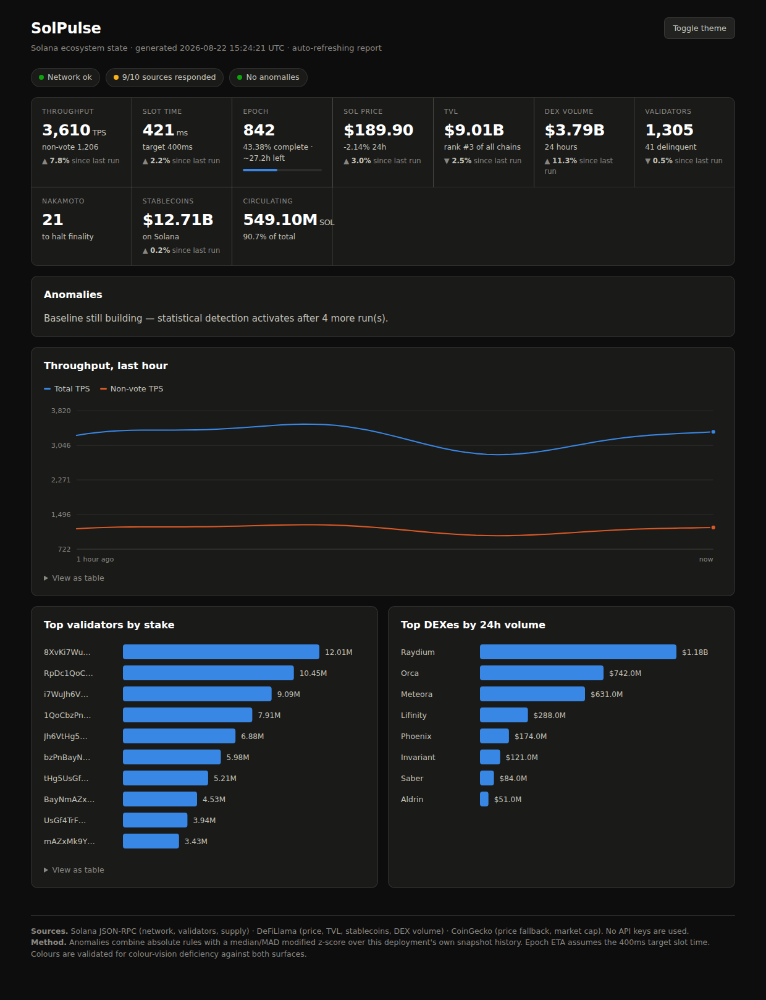
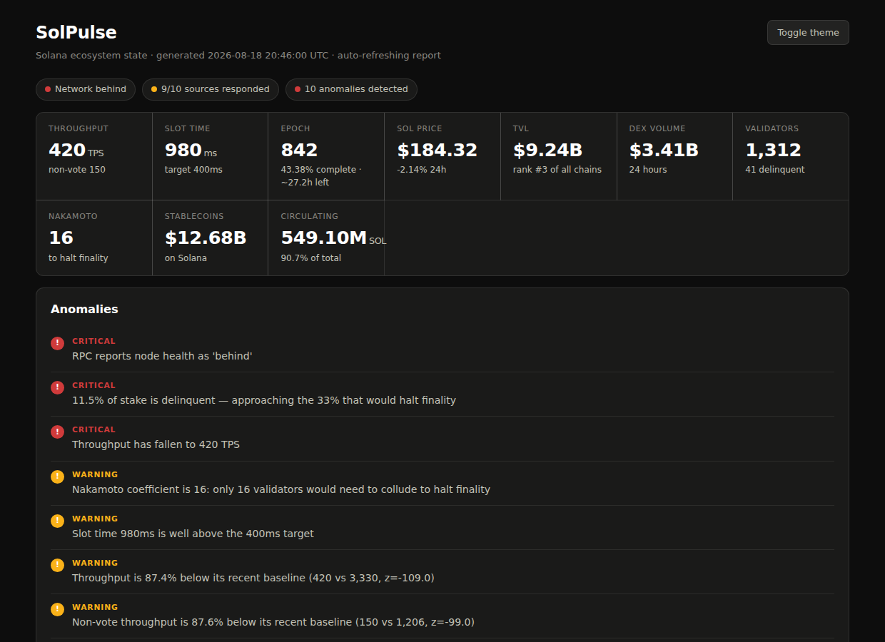

# SolPulse

**An auto-updating report on the state of the Solana ecosystem** — an interactive
HTML dashboard, a human-readable Markdown report and structured JSON, generated
from live on-chain and off-chain data.

Pure Python standard library. **No `pip install`. No API keys. No build step.**

```bash
python3 solpulse.py
```



---

## Quick start

```bash
git clone <this-repo> && cd solpulse

python3 solpulse.py              # collect live data, write all three formats
python3 solpulse.py --demo       # offline run on fixture data, no network
python3 solpulse.py --watch 300  # refresh every 5 minutes
open output/dashboard.html
```

Requires **Python 3.8+** and nothing else. There is no `requirements.txt`
because there are no requirements.

| Flag | Purpose |
|---|---|
| `--out DIR` | Output directory (default `output`) |
| `--format {all,html,markdown,json}` | Write one format instead of all three |
| `--history PATH` | Snapshot history file — the anomaly baseline |
| `--watch SECONDS` | Refresh on an interval instead of exiting |
| `--demo` | Use offline fixture data; no network needed |

**Exit codes** — `0` success · `1` every source failed · `2` a critical anomaly
is present. A scheduler or CI job can alert on the difference.

---

## Data sources and how they are integrated

Every source is keyless and public. Each is fetched independently and wrapped so
that **a failing source costs its own metrics and nothing else** — the report
still generates, and the missing source is named in the status panel rather than
silently omitted.

| Source | Provides | Endpoint |
|---|---|---|
| **Solana JSON-RPC** | Health, epoch, slot, TPS, validators, stake, supply | `api.mainnet-beta.solana.com` + two public mirrors |
| **DeFiLlama** | SOL price, TVL and chain rank, stablecoin float, DEX volume | `api.llama.fi`, `coins.llama.fi`, `stablecoins.llama.fi` |
| **CoinGecko** | Price fallback, market cap, 24h change and volume | `api.coingecko.com` (free tier) |

**RPC methods used:** `getHealth`, `getEpochInfo`, `getRecentPerformanceSamples`,
`getVoteAccounts`, `getSupply`, `getBlockTime`, `getSlot`.

Three integration details worth naming:

- **Endpoint failover.** Public RPC nodes rate-limit aggressively. The client
  tries endpoints in order, then *stays* on whichever answered rather than
  round-robining, and only searches again if that one starts failing.
- **DeFiLlama is primary for price, CoinGecko is the fallback.** CoinGecko's free
  tier increasingly demands a demo key; ordering it second means price survives
  either provider going down.
- **Defensive parsing throughout.** Upstream JSON shapes change without notice, so
  every field is read with a guard and coerced. A renamed key degrades one metric
  instead of raising.

---

## Metrics collected

**Network** — health, TPS, non-vote TPS, 1h average and peak, slot time, current
slot, block height, epoch number, epoch progress %, epoch ETA.

**Validators** — active and delinquent counts, delinquency by count and by stake,
total active stake, **Nakamoto coefficient**, top-10 stake share, median
commission, zero-commission validator count, top-10 validator table.

**Economics** — SOL price with source attribution, 24h change, market cap, TVL and
rank among all chains, TVL share, stablecoin supply on Solana, DEX volume 24h/7d
with day-over-day change, top-8 DEXes.

**Supply** — total, circulating, circulating %.

Two of these are worth calling out because most dashboards omit them:

- **Non-vote TPS.** Vote transactions dominate raw counts. Headline TPS is not a
  measure of user activity; non-vote TPS is. Both are reported, on one axis.
- **Nakamoto coefficient.** The smallest number of validators that could collude
  to halt finality — computed here from the live stake distribution against the
  ⅓ threshold. It is the single most meaningful decentralisation number on the
  page, and it moves.

---

## Anomaly detection

Two independent layers, because they fail differently.

### 1. Absolute rules

Conditions that are bad regardless of history — node health not `ok`, delinquent
stake above 5% (warning) or 10% (critical), Nakamoto coefficient under 15, slot
time over 600ms, TPS under 500. **These fire on the very first run**, when no
baseline exists yet.

The Nakamoto floor is deliberately set well below today's level. Solana's
coefficient currently sits around **19**, so a threshold at 20 would raise the
same warning on every run forever — and a panel that always shows the same alert
teaches the reader to ignore all of them. A standing structural fact belongs in
a metric tile, which is where it appears; *degradation* from the current level is
left to the statistical layer, which catches it relative to the baseline. Both
behaviours are pinned by tests.

### 2. Statistical deviation

Departure from *this deployment's own* recent history, using a **median/MAD
modified z-score** with a threshold of 3.5.

Mean and standard deviation are deliberately avoided. Crypto metrics are spiky,
and one 10× spike inflates the standard deviation so badly that later, real
anomalies stop registering. Median and MAD are resistant to exactly that — the
behaviour is pinned by a test:

```python
series = [3000, 3050, 2980, 3020, 3010, 2990, 3030, 15000]  # note the spike
_modified_z(3000, series)  # -0.51  → normal, correctly quiet
_modified_z( 800, series)  # -74.7  → the drop is still caught
```

A perfectly constant series is handled separately: the z-score is undefined
there, so a departure is judged by relative change instead — moves under 5% are
noise, anything larger reports at a fixed high score. Without this, integer
metrics that sit flat for long stretches (validator count, Nakamoto coefficient)
would silently swallow the very jump worth reporting.

### 3. Correlation

When network throughput **and** validator health both go anomalous in the same
run, that co-occurrence is reported as its own finding. During a real incident
these move together; independently they usually mean something more mundane.



Statistical detection needs **5 snapshots** before it activates. Until then the
report says so explicitly rather than implying all-clear.

---

## Automation strategy

**Snapshot history is what makes the report auto-updating rather than merely
re-runnable.** Each run appends a compact snapshot to `history.json`, capped at
500 entries. That file is the anomaly baseline — the report gets smarter the
longer it runs, with no configuration.

Three ways to run it continuously, in increasing order of hands-off:

**1. Built-in watch loop** — for a always-on machine.
```bash
python3 solpulse.py --watch 300
```
The loop survives a failed run: an exception is logged and the next tick proceeds.

**2. cron** — for a server.
```cron
*/15 * * * * cd /path/to/solpulse && python3 solpulse.py --out /var/www/solana
```

**3. GitHub Actions → GitHub Pages** — zero infrastructure, included as
[`.github/workflows/update.yml`](.github/workflows/update.yml).

The workflow runs the test suite, regenerates the report every 6 hours,
**commits `history.json` back to the repo** so the baseline survives between
ephemeral runners, and publishes the dashboard to Pages. A critical anomaly
(exit 2) surfaces as a workflow warning without blocking the deploy.

To enable: **Settings → Pages → Source: GitHub Actions**. The dashboard is then
live at `https://<user>.github.io/<repo>/`.

---

## Output formats

### Interactive HTML dashboard
Written as both `index.html` and `dashboard.html` — GitHub Pages serves
`index.html` at the directory root, and without it a published dashboard is a
404. Dark theme by default with a light toggle.

Each metric tile shows movement since the previous run, drawn from the snapshot
history. Deltas render in neutral ink with a direction glyph rather than
green/red: for most of these metrics "up" is not inherently good, and colouring
them would assert a judgement the data does not support. Self-contained — the SVG is generated
server-side and the only script is a few lines of vanilla JS for the hover
layer. **No CDN, no chart library**, which is what keeps the no-dependencies
promise honest at the presentation layer too. A test asserts the page contains
no external references at all.

Line charts carry a shared crosshair and tooltip; bars have per-mark tooltips.
Every chart has a **"View as table"** disclosure beneath it.

### Markdown report — [`samples/report.md`](samples/report.md)
Sectioned tables for network, validators, economics and per-source status.
Renders directly in a GitHub README or a Discord paste.

### JSON — [`samples/report.json`](samples/report.json)
Grouped by domain, carrying a `schema_version` so downstream consumers can
detect format changes instead of silently misreading fields. Includes the full
60-sample TPS series and the complete anomaly structure.

---

## Design decisions

**Why no dependencies.** `requests`, `pandas` and `plotly` would have been faster
to write. But the bounty asks for low-maintenance, and a report that depends on
nothing cannot break because a transitive dependency shipped a bad release. It
also runs on any machine with Python, including a locked-down CI runner, with no
install step at all.

**Why `--demo` exists.** The report can be generated, reviewed and screenshotted
with no network — which makes the project reviewable in restricted environments
and gives the test suite deterministic input. Demo runs are labelled as such in
every output.

**Why colours are validated, not chosen.** The categorical palette was checked
programmatically for colour-vision-deficiency separation against both the light
and dark surfaces (worst all-pairs CVD ΔE 26.8 dark / 24.7 light, against a
threshold of 8). Series identity is carried by a legend and end-of-line direct
labels as well as by hue; status is always icon + label + colour, never colour
alone. Slot numbers and block heights are printed in full — they are identifiers,
not magnitudes, and `298.46M` throws away the digits that make them useful.

**Graceful degradation over strictness.** Missing metrics render as `—`. A dead
source is named in the status panel. The report's job is to tell you what it
knows and be honest about what it doesn't.

---

## Tests

```bash
python3 -m unittest discover -s tests -v
```

26 tests, no network required — covering the z-score's robustness to historical
outliers and constant series, rule escalation, history round-trip and capping,
corrupt-history recovery, HTML injection escaping, self-containment of the
generated page, and rendering with metrics missing.

---

## Project layout

```
solpulse.py              entry point and CLI
solpulse/
  http.py                urllib wrapper: retries, timeouts, per-source logging
  rpc.py                 Solana JSON-RPC client with endpoint failover
  sources.py             DeFiLlama and CoinGecko collectors
  history.py             snapshot persistence — the anomaly baseline
  anomaly.py             rules + median/MAD statistics + correlation
  render_html.py         dashboard: SVG charts, hover layer, themes
  render_md.py           Markdown report
  render_json.py         structured JSON
  demo.py                offline fixture data
tests/test_solpulse.py   22 unit tests
.github/workflows/       scheduled regeneration and Pages deploy
samples/                 example Markdown and JSON output
```

## License

MIT
